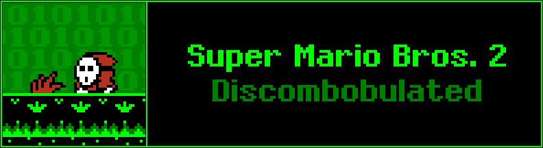

# Super Mario Bros. 2, Discombobulated
\
A disassembly of Super Mario Bros. 2.

This is designed for use with [asm6f](https://github.com/freem/asm6f/).
For your convinience, binaries of that have been included. (Windows/Linux)

## Building

### Windows
Open a command prompt window and run:

    build           (builds PRG0)
	build -dREV_A   (builds PRG1)

This will build the ROM from the assembly, and print any errors in the process.
It will then output the SHA-256 hashes of PRG0 and PRG1, as well as the SHA-256
hash of the assembled ROM, useful if you intend to keep a one-to-one build.

### Linux, etc
A version of `asm6f` built under Ubuntu has been included under `tools/`.
To build, run the following command:

	./build.sh           (builds PRG0)
	./build.sh -dREV_A   (builds PRG1)
	./build.sh test      (builds both PRG0 and PRG1, verifying they match)

The build script will also display a message if the built ROM's SHA-256 hash
matches either PRG0 or PRG1.

### Output
The build process will generate a few files:

* `bin/smb2.nes`, your assembled ROM.
* `bin/smb2.lst`, the assembler listing. Use this to see how the code assembled.
* `bin/assembler.txt`, the log from the assembler
* `bin/smb2.*.nl`, name-listing files for FCEUX's debugger.
* Some other cruft, probably. welp

**By default, the build script will create a byte-for-byte copy of the game**,
matching these two SHA-256 hashes:

* PRG0: `47ba60fad332fdea5ae44b7979fe1ee78de1d316ee027fea2ad5fe3c0d86f25a`
* PRG1: `6ca47e9da206914730895e45fef4f7393e59772c1c80e9b9befc1a01d7ecf724`

You can edit `config.asm` to change some build options; see that file for details.

## Assembly
The "source" lives in the `src` directory:

* `prg-x-x.asm` are the program banks. They are grouped in pairs, as that is how
  SMB2 loads them. If you want to change this, you will need to split them apart again.
* `defs.asm` defines various enums and identifiers.
* `ram.asm` contains labels and definitions for RAM addresses.
* `extras/` contains some additional fun things (see `config.asm`).
* `levels/` contains level and enemy data.
* This list is growing as we split the disassembly into smaller parts.

## Contributing
* Fork the repository.
* Make changes.
* Submit a pull request!
* You are also encouraged to visit the [Discord server](https://discord.gg/TsWMMeV)
  if you have any questions.

We do not have a formal style guide yet. Sorry.

## See Also
* [Data Crystal's SMB2 page](http://datacrystal.romhacking.net/wiki/Super_Mario_Bros._2)
* [CaptainSouthbird's SMB3 disassembly](https://github.com/Drakim/smb3) and [Drakim's asm6f version](https://github.com/Drakim/smb3)
* [Our Discord server](https://discord.gg/TsWMMeV)
